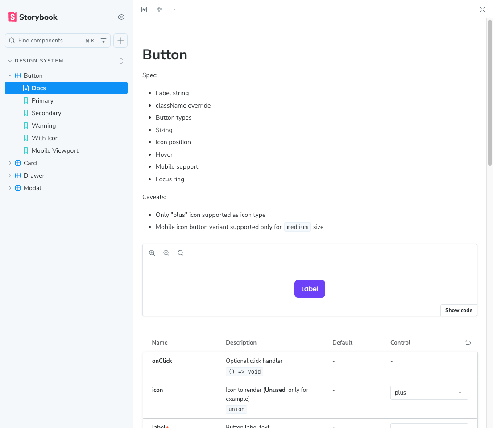

# Penny Design System - Example

"Penny" - minimal example of a design system implementation example; [Figma](https://www.figma.com/design/wwAMVAirmeYLPxt1oq6IoB/Penny---Design-System-example?node-id=0-1&t=GdqcYMk1yqHFwWnL-1).

Supported components:

1. Button
2. Card
3. Modal
4. Drawer


## Goal

1. Bootstap template
2. Implementation example

## Installation

```
yarn install
yarn storybook
```



## Package Details

| Package                       | Explanation                                                            |
| ----------------------------- | ---------------------------------------------------------------------- |
| Vite (React+Typescript)       | Build tool                                                             |
| Storybook                     | UI documentation and development environment                           |
| Tailwind CSS                  | CSS simplification layer                                               |
| Headless UI                   | Minimal layer on top of native HTML elements (unstyled, accessibility) |
| `cva`                         | CSS-in-TS variants layer (build complicated CSS variants)              |
| `cx`                          | Conditional string joins (build complicated `classNames`)              |
| Prettier + Tailwind plugin    | Formatting regex detected plaintext (format tw class names)            |
| `vite-tsconfig-paths`         | Considers TS compiler path alias feature                               |
| `@storybook/builder-vite`     | Considers the vite builder for SB (to include path aliases)            |
| PostCSS + Autoprefixer plugin | Transform CSS styles with JS plugins (used by tw)                      |

## DevX configurations

Allow tailwind [IntelliSense](https://tailwindcss.com/docs/editor-setup) in VSCode, extend `settings.json`:

```
  // tailwind
  "tailwindCSS.experimental.classRegex": [
    ["cva\\(((?:[^()]|\\([^()]*\\))*)\\)", "[\"'`]([^\"'`]*).*?[\"'`]"],
    ["cx\\(((?:[^()]|\\([^()]*\\))*)\\)", "(?:'|\"|`)([^']*)(?:'|\"|`)"],
    ["clsx\\(([^)]*)\\)", "\"([^\"]*)\""]
  ],
  "tailwindCSS.includeLanguages": {
    "html.erb": "html",
    "javascript": "javascript",
    "typescriptreact": "typescriptreact",
    "typescript": "typescript"
  },
```

This allows extension detect+lint inside `cva()`,`cx()`,`clsx()` scope.
